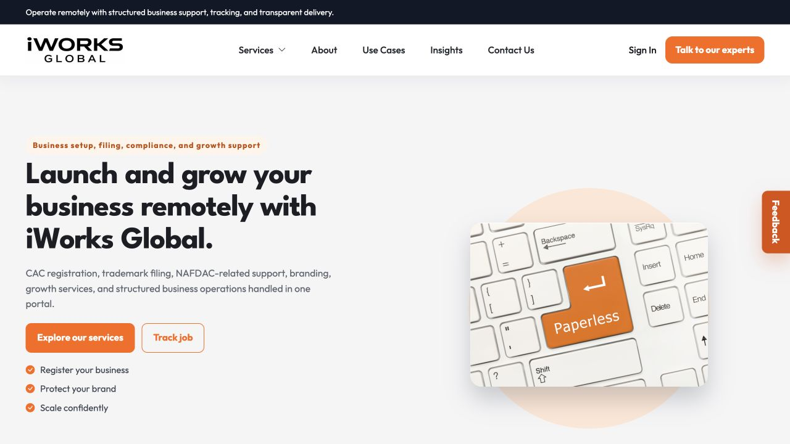
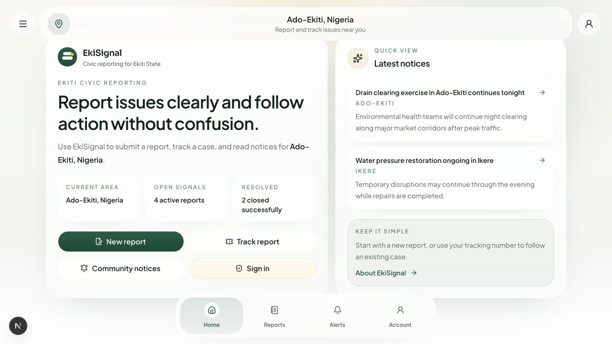
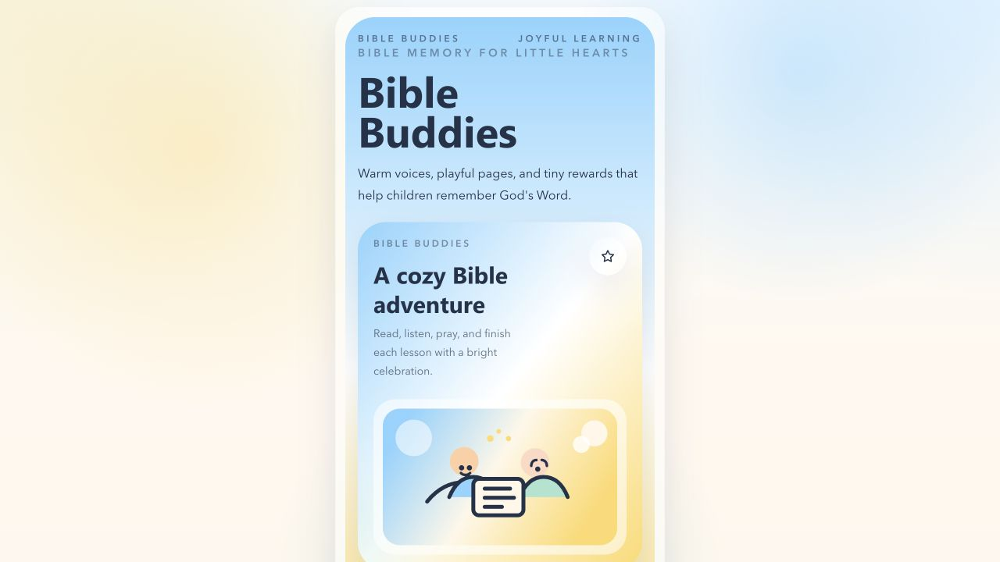
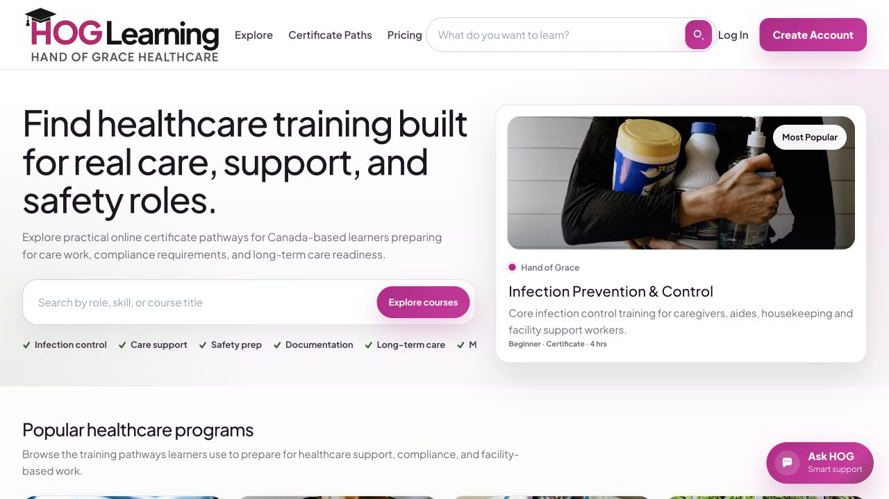
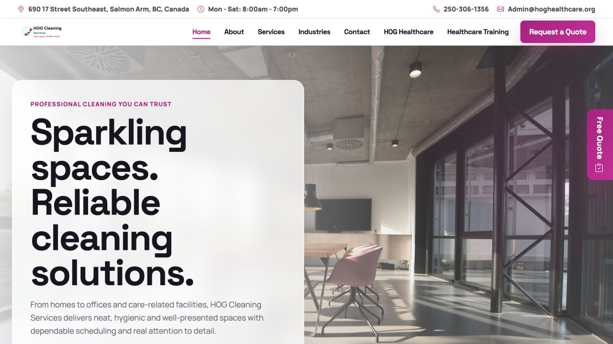
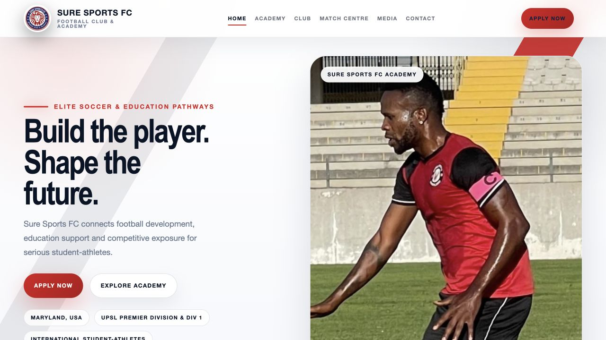
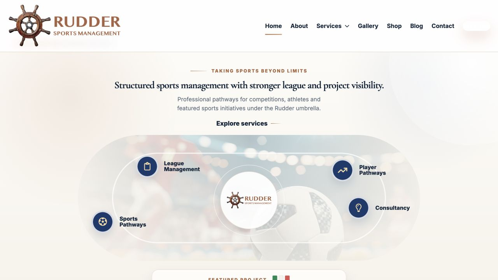

# Afolayan Opeyemi Ayomikun | Full-Stack Software Developer

I'm a Nigeria-based full-stack software developer and product engineer building production-ready SaaS, ecommerce, POS, payment, learning-management, civic-technology, mobile, and business web applications.

My core stack includes Laravel, PHP, React, Next.js, TypeScript, Node.js, MySQL, PostgreSQL, React Native, WordPress, Supabase, and progressive web app technologies. I take products from requirements and database design through secure backend workflows, responsive interfaces, testing, deployment, and ongoing operations.

I have completed more than 50 web projects and am open to remote, international, and relocation-supported software engineering opportunities. I work from Nigeria (UTC+1) and can collaborate across time zones.

## Professional profile

- End-to-end product delivery across backend, frontend, mobile, database, integrations, and deployment
- Production experience with multi-tenant SaaS, ecommerce, browser POS, payments, authentication, role-based access control, LMS, CMS, and offline-first PWA workflows
- Nine public source-code case studies, six live production deployments, and one interactive ecommerce preview linked below
- Engineering evidence including automated tests, GitHub Actions CI, documented setup, security notes, and environment-safe public repositories
- Cross-sector delivery for commerce, professional services, healthcare training, civic engagement, children's education, cleaning services, and sports organizations

## Portfolio at a glance

| Project | Product area | Primary technology | Evidence |
| --- | --- | --- | --- |
| Kobiza | Multi-tenant commerce, POS, invoicing, inventory, and merchant SaaS | Laravel, React, TypeScript, Inertia, PostgreSQL | [Source](https://github.com/oprahayo/kobiza) |
| Jewaco Electronics | Ecommerce catalogue, customer accounts, offers, wishlist, and PWA | React, TypeScript, Vite, TanStack Query | [Source](https://github.com/oprahayo/jewaco-electronics-commerce) · [Live preview](https://7z4hnammb2.preview.c37.airoapp.ai/?airoShareToken=6dqNtT6FQV5G) |
| Tridan Business Concepts | UK consultancy website and lead-generation experience | WordPress, responsive web design | [Live](https://tridanbcl.com/) |
| iWorks GT | Service operations, payments, delivery, commissions, and reporting | PHP, MySQL, JavaScript | [Source](https://github.com/oprahayo/iworksgt-service-portal) · [Live](https://portal.iworksgt.com/) |
| Eki Suggest / EkiSignal | Civic reporting, issue tracking, moderation, and public-sector routing | Next.js, React, TypeScript, Supabase, PWA | [Source](https://github.com/oprahayo/eki-suggest) |
| GraceKids | Family devotion platform with backend, web dashboard, and mobile app | Node.js, Express, React, React Native, MySQL | [Source](https://github.com/oprahayo/gracekids-devotion-app) |
| HOG Healthcare LMS | Healthcare learning, assessments, certificates, and administration | PHP, MySQL, JavaScript | [Source](https://github.com/oprahayo/hog-healthcare-lms) · [Live](https://hoghealthcare.org/lms/index.php) |
| HOG Cleaning Services | Conversion-focused service marketing website | HTML, CSS, Bootstrap | [Source](https://github.com/oprahayo/hog-cleaning-services) · [Live](https://hoghealthcare.org/hog-cleaning/) |
| Sure Sports FC | Club, academy, recruitment, sponsorship, and media website | HTML, CSS, JavaScript, PHP | [Source](https://github.com/oprahayo/sure-sports-fc-website) · [Live](https://suresports.org/) |
| Rudder Sports Management | PHP content management, events, gallery, blog, and shop structure | PHP, JSON, JavaScript | [Source](https://github.com/oprahayo/rudder-sports-management-site) · [Live](https://ruddersports.com/) |

## Selected engineering case studies

### [Kobiza Commerce Platform](https://github.com/oprahayo/kobiza)

A multi-tenant commerce, POS, invoicing, inventory, and business-management SaaS designed for African merchants.

- Laravel, React, TypeScript, Inertia, PostgreSQL/SQLite, Redis-ready queues, and PWA support
- Online storefront, cart, checkout, orders, invoices, payments, receipts, and customer CRM
- Touch-friendly browser POS with cashier shifts, split payments, and barcode scanning
- Shared Scan Engine for camera, USB, Bluetooth, Android POS, and future terminal adapters
- Tenant-scoped roles, permissions, audit logs, public tokens, and cross-tenant tests
- 116 application tests, scanner tests, production builds, and GitHub Actions CI

[View the source code](https://github.com/oprahayo/kobiza)

### [Jewaco Electronics Commerce Platform](https://github.com/oprahayo/jewaco-electronics-commerce)

A responsive React and TypeScript ecommerce PWA designed for a Nigerian electronics retailer with a 417-item catalogue.

- Vite, React Router, TanStack Query, Better Auth client, Motion, React Helmet, and reusable component architecture
- Product catalogue, category and brand discovery, responsive search, detailed product pages, discounts, and stock state
- Customer accounts, protected cart and offer flows, wishlist, history, notifications, and PWA installation surfaces
- Negotiated-price workflow and prefilled WhatsApp product enquiries for assisted conversion
- Dedicated desktop and mobile navigation with responsive product grids and customer actions
- Six-screen visual case study with verified codebase map, architecture, and production-readiness notes

[View the technical case study](https://github.com/oprahayo/jewaco-electronics-commerce) · [Open the live preview](https://7z4hnammb2.preview.c37.airoapp.ai/?airoShareToken=6dqNtT6FQV5G)

### [Tridan Business Concepts Ltd](https://tridanbcl.com/)

A production WordPress website for a UK consultancy serving the finance, education, governance, technology, and public sectors.

- Responsive multi-page experience covering Home, About, Services, Social Values, Case Studies, and Contact
- Clear service presentation for Finance & Governance, Education Consultancy, and Technology & Digital Services
- Ten-year company story, strategic goals, credibility signals, testimonial, and conversion-focused calls to action
- Structured contact and enquiry pathways for education and public-sector clients
- Live deployment on the client’s production domain

[View the live website](https://tridanbcl.com/)

### [iWorks GT Service Portal](https://github.com/oprahayo/iworksgt-service-portal)

A full-stack service operations platform for customers, agents, finance teams, and administrators.

- Multi-role dashboards and role-based access control
- Paystack, Flutterwave, Stripe, bank-transfer, and crypto payment flows
- SSO, email OTP, trusted devices, OAuth, and password recovery
- Job assignment, delivery tracking, commissions, withdrawals, and reporting
- CMS, service catalog, blog, media library, and configurable intake forms
- PHP smoke tests and continuous integration with GitHub Actions

[View the source code](https://github.com/oprahayo/iworksgt-service-portal) · [View the live product](https://portal.iworksgt.com/)

### [Eki Suggest / EkiSignal](https://github.com/oprahayo/eki-suggest)

A mobile-first civic reporting platform for Ekiti State, built for public issue reporting, tracking, moderation, routing, and government-desk workflows.

- Next.js App Router, React, TypeScript, and Tailwind CSS
- Citizen PWA with report submission, tracking, offline shell, install surfaces, and weak-network recovery
- Admin dashboard for moderation, assignment, analytics, exports, and report workbench review
- Handler dashboard for assigned government offices
- Supabase schema, seed data, typed database models, and report workflow helpers
- GitHub Actions checks for TypeScript and linting

[View the source code](https://github.com/oprahayo/eki-suggest)

### [GraceKids Devotion App](https://github.com/oprahayo/gracekids-devotion-app)

A full-stack Bible memory and devotion platform for children and families, with backend API, web dashboard, mobile app, and database design.

- Node.js, Express, TypeScript, MySQL, JWT, and bcrypt backend
- React/Vite web app for admin, parent, child, lesson, subscription, and content flows
- Expo/React Native mobile app for GraceKids Devotion
- GraceKids child profiles, badges, tasks, reminders, weekly progress, and devotion content
- Optional text-to-speech support and media/content management workflows
- GitHub Actions checks for backend, frontend, and mobile TypeScript

[View the source code](https://github.com/oprahayo/gracekids-devotion-app)

### [HOG Healthcare LMS](https://github.com/oprahayo/hog-healthcare-lms)

A healthcare learning management portal for online certificate pathways, learner onboarding, assessments, certificates, transcripts, support workflows, and admin operations.

- Public course catalogue and certificate pathway pages
- Learner registration, login, dashboard, lessons, billing, certificates, and transcripts
- Admin tools for courses, students, instructors, certificates, payments, reports, and settings
- HOG AI Support interface and support-ticket flow
- Security-minded PHP structure with CSRF checks, password hashing, protected runtime storage, and safe public config examples
- MySQL starter schema and GitHub Actions PHP linting

[View the source code](https://github.com/oprahayo/hog-healthcare-lms) · [View the live LMS](https://hoghealthcare.org/lms/index.php)

### [HOG Cleaning Services Website](https://github.com/oprahayo/hog-cleaning-services)

A responsive service website for a cleaning business, built to present services clearly and convert visitors into quote requests.

- Home, About, Services, Industries, and Contact pages
- Mobile-first layout with polished service cards, packages, testimonials, and calls to action
- Quote-request page structure connected to the wider HOG Healthcare ecosystem
- Bootstrap-based frontend with custom brand styling
- SEO-friendly page titles and descriptions
- Static-site CI checks for required files and page titles

[View the source code](https://github.com/oprahayo/hog-cleaning-services) · [View the live website](https://hoghealthcare.org/hog-cleaning/)

### [Sure Sports FC Website](https://github.com/oprahayo/sure-sports-fc-website)

A responsive club and academy website for recruitment, media storytelling, sponsorship visibility, applications, and future CMS planning.

- Public club, academy, team, fixtures, media, shop, sponsorship, contact, and application pages
- Mobile-responsive HTML, CSS, and JavaScript frontend
- PHP academy application handoff
- Admin/CMS prototype and MySQL backend planning documents
- Live sports-club deployment on a real domain
- GitHub Actions static checks and PHP linting

[View the source code](https://github.com/oprahayo/sure-sports-fc-website) · [View the live website](https://suresports.org)

### [Rudder Sports Management Website](https://github.com/oprahayo/rudder-sports-management-site)

A PHP sports management and event website with admin-managed content, gallery, blog, shop-ready structure, contact handling, and JSON data storage.

- Public company, services, gallery, blog, shop, product, order, leagues, and contact pages
- PHP admin dashboard for website info, posts, gallery items, messages, products, and orders
- JSON-backed content storage for lightweight cPanel deployment
- Runtime credentials, messages, orders, and uploads excluded from the public repo
- Live sports/event brand deployment
- GitHub Actions PHP linting

[View the source code](https://github.com/oprahayo/rudder-sports-management-site) · [View the live website](https://ruddersports.com)

## Technical expertise

- **Backend:** Laravel, PHP, Node.js, Express, PDO, REST APIs, authentication, role-based access control, background-job and webhook workflows
- **Frontend:** React, Next.js, Inertia, TypeScript, JavaScript, Vite, HTML, CSS, Tailwind CSS, Bootstrap, responsive user interfaces
- **Data:** PostgreSQL, MySQL, MariaDB, SQLite, Supabase, relational data modelling, JSON-backed content systems
- **Mobile and PWA:** React Native, Expo, service workers, installable apps, offline and weak-network experiences
- **Platforms and delivery:** WordPress, Apache, cPanel, GitHub Actions, automated testing, production deployment, environment configuration
- **Integrations:** Paystack, Flutterwave, Stripe, Google OAuth, OpenAI, SMTP, media uploads, CSV reporting
- **Product domains:** SaaS, ecommerce, point of sale, payments, LMS, civic tech, CMS, workflow automation, service operations

## What I bring

- I own features from requirements and database design to tested, deployed user experiences.
- I translate real operational and commercial processes into maintainable software workflows.
- I build with security, mobile usability, accessibility, performance, lead generation, and day-to-day administration in mind.
- I document setup and deployment so another engineer can understand, run, and extend the work.
- I am comfortable improving existing systems, integrating third-party services, and starting new digital products.

## Career direction

I'm open to full-stack software developer, product engineer, PHP/Laravel backend developer, React/Next.js developer, and mobile application roles. I welcome remote, international, and relocation-supported opportunities where I can contribute to a strong engineering team and ship useful digital products.

For hiring, technical collaboration, or project enquiries, contact me through [GitHub](https://github.com/oprahayo).
